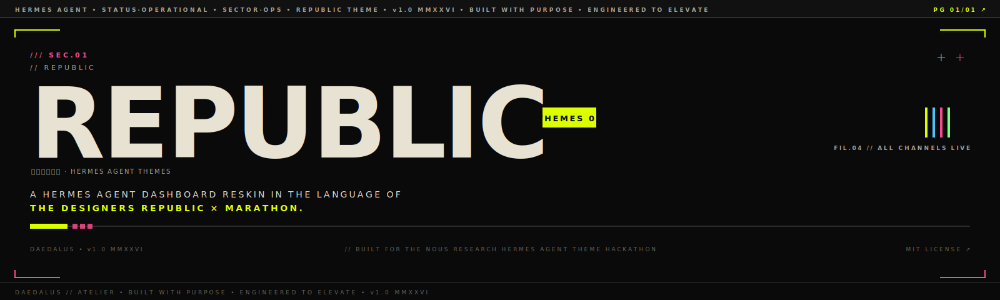
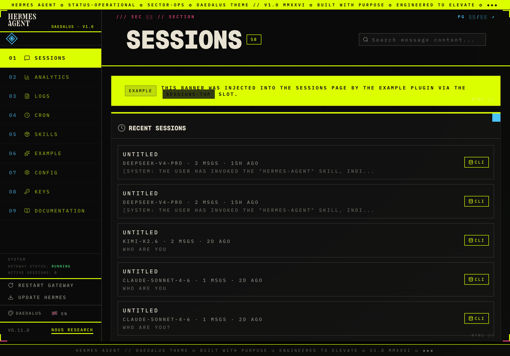
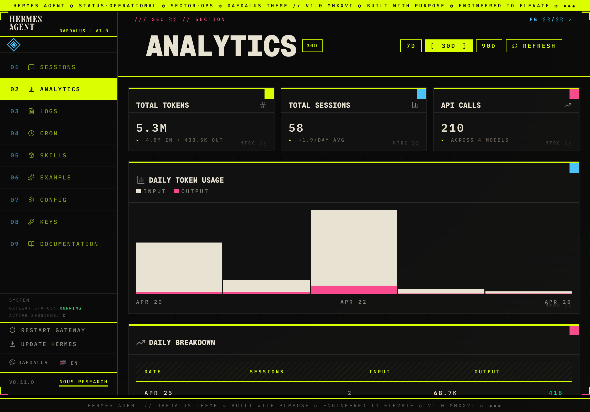
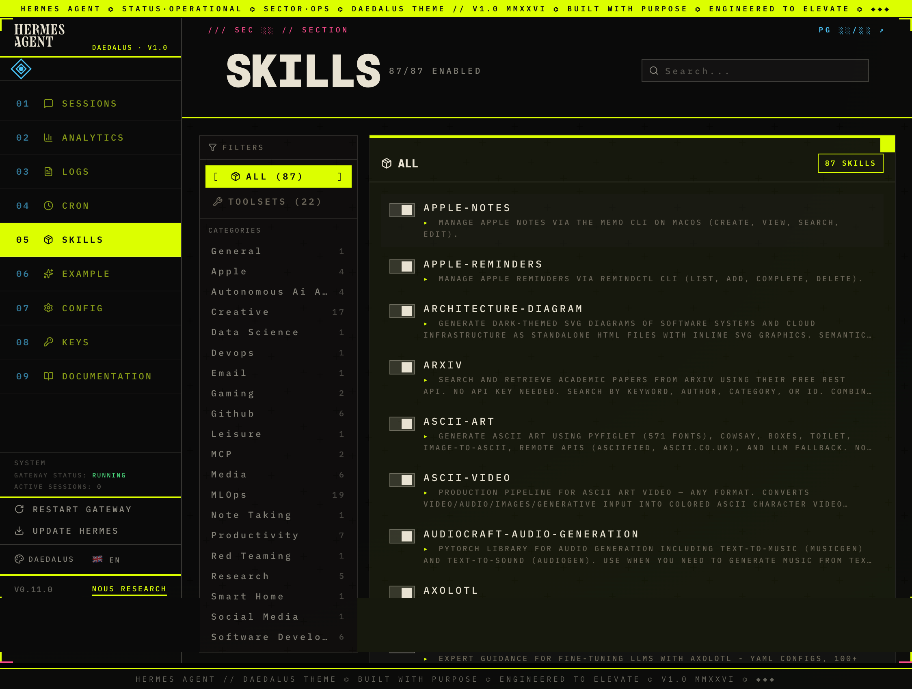
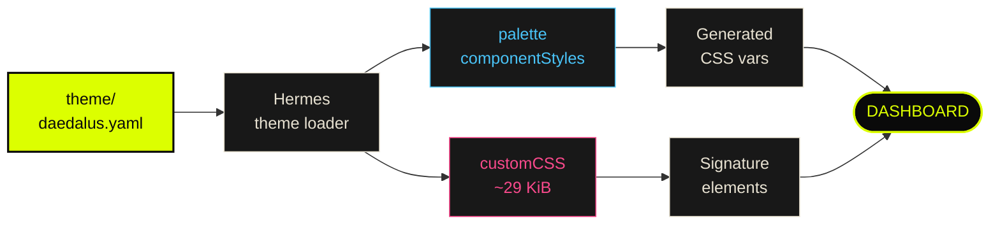

<div align="center">



<br>

[](LICENSE)
[](https://github.com/NousResearch/hermes-agent)
[](DESIGN.md)
[](https://nousresearch.com/)
[](DESIGN.md)

**`/// SEC.01`** &nbsp;&nbsp;**Themes for [Hermes Agent](https://github.com/NousResearch/hermes-agent)** in the visual language of **The Designers Republic** and **Marathon** *(Kurppa Hosk × Bungie, 2026)*. &nbsp;&nbsp;**`PG 01/01 ↗`**

[Install](#-install) &nbsp;·&nbsp; [Design System](#-design-system) &nbsp;·&nbsp; [Customize](#-customize) &nbsp;·&nbsp; [Influences](#-influences)

</div>

---

## `/// SEC.01` &nbsp; OVERVIEW

The default Hermes Teal theme is a soft cream on dark teal — polished, warm, easy. Republic is the opposite move. Bone parchment over near-black ground. Radioactive yellow as **structural material**, not accent. Magenta and cyan as instrument micro-marks. Geist Mono Bold and IBM Plex everywhere. Square corners, hairline rules, sector codes, page numbers, faction tags.

The agent stops being a friendly chat companion and becomes a **system console** — a Sector-01 readout with a sigil, a faction tag, and a launch latch. That contrast against the soft Hermes Teal default is the point.

> [!NOTE]
> **`v1.0 — DAEDALUS`** is the first theme in the Republic atelier. Built for the **Nous Research Hermes Agent Theme Hackathon** (April 2026, $350 theme track).

---

## `/// SEC.02` &nbsp; SCREENSHOTS

<div align="center">



<sub>**`MTRC.001 // SESSIONS`** — the operator's open conversation pool. Yellow active nav, magenta sector eyebrow, plugin-injected status banner with the Yellow Contract enforced on descendants.</sub>

<br><br>

<table>
<tr>
<td width="50%" align="center">

<sub><strong><code>MTRC.002 // ANALYTICS</code></strong> — metric plates with rotating corner blocks (yellow → cyan → magenta → lime). Recharts bars in bone + magenta. Yellow reserved for chrome.</sub>
</td>
<td width="50%" align="center">

<sub><strong><code>MTRC.003 // SKILLS</code></strong> — faction-tagged registry. Mono-caps labels, hairline rules between rows, cyan counters on numbered nav.</sub>
</td>
</tr>
</table>

</div>

---

## `/// SEC.03` &nbsp; INSTALL

`Daedalus` is a single self-contained YAML theme. Works with **Hermes Agent v0.11.0+**.

### `[ ONE-LINE INSTALL ]`

```bash
curl -fsSL https://raw.githubusercontent.com/JustinPerea/Republic/main/theme/daedalus.yaml \
  -o ~/.hermes/dashboard-themes/daedalus.yaml
```

If you use Hermes profiles (`~/.hermes/profiles/<name>/`), copy to that profile's `dashboard-themes/` directory instead — Hermes is profile-aware via `~/.hermes/active_profile`.

### `[ MANUAL INSTALL ]`

1. Download [`theme/daedalus.yaml`](theme/daedalus.yaml).
2. Place it in **either** of these locations:
   - `~/.hermes/dashboard-themes/daedalus.yaml`
   - `~/.hermes/profiles/<active-profile>/dashboard-themes/daedalus.yaml`
3. Restart the Hermes dashboard, or hit the rescan endpoint:
   ```bash
   curl http://127.0.0.1:9119/api/dashboard/plugins/rescan
   ```
4. Open the dashboard and select **`DAEDALUS`** from the theme picker.

### `[ BELT-AND-SUSPENDERS INSTALL ]`

Apply regardless of which profile is active — install in both locations:

```bash
THEME_URL="https://raw.githubusercontent.com/JustinPerea/Republic/main/theme/daedalus.yaml"
curl -fsSL "$THEME_URL" -o ~/.hermes/dashboard-themes/daedalus.yaml
mkdir -p ~/.hermes/profiles/$(cat ~/.hermes/active_profile 2>/dev/null || echo default)/dashboard-themes
curl -fsSL "$THEME_URL" \
  -o ~/.hermes/profiles/$(cat ~/.hermes/active_profile 2>/dev/null || echo default)/dashboard-themes/daedalus.yaml
```

> [!TIP]
> If the theme doesn't appear in the picker after install, hit the rescan endpoint above. Hermes caches the theme list per session.

---

## `/// SEC.04` &nbsp; DESIGN SYSTEM

The full spec lives in **[`DESIGN.md`](DESIGN.md)** — 12 sections, 500 lines, every token, every selector, every locked decision.

| `MTRC` | Pillar | Spec |
|---|---|---|
| `001` | **Color** | 3-layer black/bone/yellow base + cyan secondary + magenta tertiary + lime success. Yellow is **structural material** — load-bearing chrome, not a thin accent. Magenta + cyan are chronic chrome accents (`/// SEC` eyebrow, page indicator, frame bottom edge). Enforced via [the Yellow Contract](DESIGN.md#the-yellow-contract-contrast-guard). |
| `002` | **Type** | Geist Mono Bold (display) + IBM Plex Sans (body) + IBM Plex Mono (every label). [Token-based scale](DESIGN.md#typography) — 6 sizes, 5 trackings, 4 line-heights. Reach for `--type-eyebrow` instead of `font-size: 9px`. |
| `003` | **Spacing** | 4-base grid (`--space-1` through `--space-9`). Off-grid values are not allowed. Layout constants (status-strip height, ticker height) deliberately stay numeric — they track other constants, not design intent. |
| `004` | **Components** | Cards with yellow top stripe + color-rotating corner block (yellow → cyan → magenta → lime). Buttons as solid yellow plates rendered `[ EXECUTE ]`. Badges as yellow stamps. Numbered sidebar nav with cyan counters. Magenta `/// SEC` page eyebrow. |
| `005` | **Signature** | Top status strip running `HERMES AGENT ⌬ STATUS·OPERATIONAL ⌬ ...`. Corner-bracket frame (yellow top + sides, magenta bottom). Registration `+` marks scattered on the content area. Mono footer ticker. |

### `[ THE PALETTE ]`

<table>
<tr>
<td align="center" width="16.66%"><div style="background:#0A0A0A;height:48px;border:1px solid #444;"></div><br><sub><code>--ink-base</code><br><code>#0A0A0A</code></sub></td>
<td align="center" width="16.66%"><div style="background:#E8E2D2;height:48px;"></div><br><sub><code>--bone</code><br><code>#E8E2D2</code></sub></td>
<td align="center" width="16.66%"><div style="background:#DCFF00;height:48px;"></div><br><sub><code>--rad-yellow</code><br><code>#DCFF00</code></sub></td>
<td align="center" width="16.66%"><div style="background:#4AC4F8;height:48px;"></div><br><sub><code>--cyan</code><br><code>#4AC4F8</code></sub></td>
<td align="center" width="16.66%"><div style="background:#F84A8C;height:48px;"></div><br><sub><code>--magenta</code><br><code>#F84A8C</code></sub></td>
<td align="center" width="16.66%"><div style="background:#7FFF7F;height:48px;"></div><br><sub><code>--lime</code><br><code>#7FFF7F</code></sub></td>
</tr>
</table>

### `[ HOW THE THEME TALKS TO HERMES ]`



### `[ SELECTOR STABILITY TIERS ]`

The theme talks to Hermes through three layers with different upgrade-resilience guarantees. Documented in [`DESIGN.md` § 12.5](DESIGN.md#125-selector-stability-tiers).

| Tier | Guarantee | Targets |
|---|---|---|
| **`TIER.01`** &nbsp;`[STABLE]` | Survives Hermes updates | `palette` / `componentStyles` / generated CSS vars |
| **`TIER.02`** &nbsp;`[SEMI-STABLE]` | Standard web platform | Standard HTML / ARIA / `aside#app-sidebar` / `header[role="banner"]` / pseudo-elements |
| **`TIER.03`** &nbsp;`[FRAGILE]` | Could break on any Hermes update | Tailwind class substrings on Hermes' shadcn fork (`button[class*="gap-2"]`...) |

> [!WARNING]
> Each `TIER.03` selector in `theme/daedalus.yaml.template` is annotated `FRAGILE — see DESIGN.md`. If a Hermes update changes a Tailwind class name, the theme degrades to *"Hermes default with our palette"* rather than visibly breaking.

---

## `/// SEC.05` &nbsp; CUSTOMIZE

The shipped `theme/daedalus.yaml` is generated from `theme/daedalus.yaml.template` (which has the sigil image embedded as a base64 placeholder). To regenerate after tweaks:

```bash
python3 - << 'PYEOF'
import base64
sigil_b64 = base64.b64encode(open('assets/sigil.jpg', 'rb').read()).decode('ascii')
data_url = f"data:image/jpeg;base64,{sigil_b64}"
template = open('theme/daedalus.yaml.template').read()
open('theme/daedalus.yaml', 'w').write(template.replace('__SIGIL_DATA_URL__', data_url))
PYEOF
```

> [!NOTE]
> The `customCSS` block is capped at **32 KiB** by Hermes. Daedalus ships at **~29 KiB** — about 3 KiB of headroom for forks.

---

## `/// SEC.06` &nbsp; INFLUENCES

| `[REF]` | Source | What we steal |
|---|---|---|
| `001` | **The Designers Republic** *(WipEout, Aphex Twin, PWEI)* | Anti-corporate corporate language: TM marks, version numbers, sector codes, "BUILT WITH PURPOSE" stamps. Saturated electric accents on near-black. Hash/stripe dividers. Fake spec-sheet labels everywhere. |
| `002` | **Marathon** *(Kurppa Hosk × Bungie, 2026)* | Faction identity systems. Status banners with bold blocks of color. Industrial product photography composited with brand marks. Recon-shell technical aesthetic. Three-tier font logic. |
| `003` | **Sekiguchi Genetics** *(Marathon faction)* | Two-color discipline. Modular tile letterforms. Bilingual Latin / katakana label pairs as parallel specification. |
| `004` | **AXION brand kit** mockups | Page numbering (`02/06`). Top-right corner arrow. Status banner with launch-console button. Engineered-product photography energy. |

---

## `/// SEC.07` &nbsp; LICENSE & CREDITS

[**MIT**](LICENSE) — use, modify, fork, ship.

Built by [**Justin Perea**](https://justinperea.com) for the [**Hermes Agent Theme Hackathon**](https://github.com/NousResearch/hermes-agent), Nous Research, April 2026.

<div align="center">

<br>

`━━━━━━━━━━━━━━━━━━━━━━━━━━━━ ░░░░░░░░░░ ━━━━━━━━━━━━━━━━━━━━━━━━━━━━`

**`DAEDALUS // ATELIER · BUILT WITH PURPOSE · ENGINEERED TO ELEVATE · v1.0 MMXXVI`**

</div>
